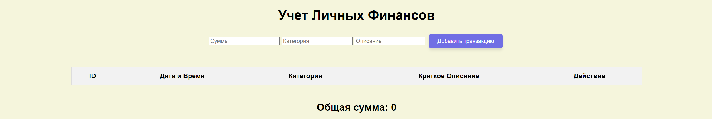

# Проект "Учета личных финансов"

## Запуск проекта

1. Склонируйте репозиторий на свой компьютер.
2. Откройте файл `index.html` в любом веб-браузере.

## Описание индивидуальной работы

Этот проект предназначен для отображения случайных активностей, которыми может заниматься капитан Смит. Он использует внешний API для получения случайных активностей и отображает их на веб-странице. Проект также обновляет данные каждую минуту.

## Краткая документация проекта

### Файлы проекта:

- index.html: Основной HTML-файл, содержащий структуру страницы.
- index.css: Файл стилей для оформления страницы.
- index.js: Основной JavaScript-файл, обрабатывающий логику обновления данных и отображения активностей.

### Использование проекта:

Откройте index.html в вашем веб-браузере. Вы увидите интерфейс для ввода и отображения транзакций.
## Документирование проекта
Код корректно задокументирован, используя стандарт JSDoc. Каждая функция и метод описаны с указанием их входных параметров, выходных данных и описанием функционала. Комментарии понятные, четкие и информативные, чтобы обеспечить понимание работы кода другим разработчикам.

## Примеры использования проекта

## Ответы на контрольные вопросы

Каким образом можно получить доступ к элементу на веб-странице с помощью JavaScript?

Используя методы getElementById, getElementsByClassName, getElementsByTagName, querySelector и querySelectorAll.
Что такое делегирование событий и как оно используется для эффективного управления событиями на элементах DOM?

Делегирование событий — это техника, при которой событие обрабатывается не на целевом элементе, а на его родительском элементе. Это эффективно, так как позволяет минимизировать количество обработчиков событий и управлять событиями на динамически добавляемых элементах.
Как можно изменить содержимое элемента DOM с помощью JavaScript после его выборки?

Используя свойства innerHTML, textContent или методы appendChild, removeChild, replaceChild.
Как можно добавить новый элемент в DOM дерево с помощью JavaScript?

Создав новый элемент с помощью document.createElement и добавив его в DOM дерево с использованием методов appendChild или insertBefore.
## Использованные источники

- [MDN Web Docs](https://developer.mozilla.org/)
- [Stack Overflow](https://stackoverflow.com/)

